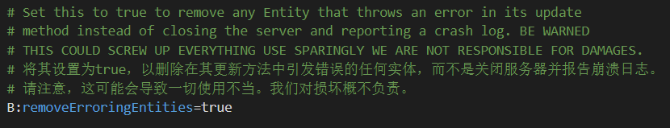

# 如果你的客户端崩溃了

Q：我的游戏崩溃了？

A：以下列举几种常见崩溃的处理方法。

> 小贴士：在错误报告中使用Ctrl+F搜索相关字符更快锁定问题~

---

* 启动崩溃：

检查游戏是否正确选择JAVA，分配内存是否过低。

  ——————————————

* 启动游戏正常，进存档崩溃：

> java.lang.NullPointerException【空指针】

  正版则重新登录，离线玩家请删除账号重新配置。

  ——————————————

* 进多人游戏时出现连接丢失：

> java.lang.NullPointer Exception:group【多人游戏空指针】

  同理，方法同上。

  ——————————————

* buff冲突导致崩溃：

> java.lang.ClassCastException【实体异常】

  

  

> 图一为实体小火球诱发崩溃，图二为NPC导致的并发异常。

  请在游戏目录\.minecraft\config\forge.cfg\中，把RemoveErroringEntities选项的false改成true

  ——————————————

* 安全问题导致崩溃：

> java.lang.SecurityException【检测资源文件完整性】

  在\.minecraft\versions\1.7.10下用压缩包打开1.7.10.jar，删除META-INF文件夹。

  ——————————————

  尽管如此仍然有一些崩溃是无法避免的，这里有两个高危地点：

* 萨拉托加啸风剑支线：传送直接进行boss战，经过多次测试boss几乎不会造成闪退。

  ```
  /tp @a -1092 41 77

  ```
* 6.5章最后的防守战：闪退后再进入游戏剧情将强制停止，不要继续等待，输入指令继续剧情。

  ```
  /setblock -1772 66 697 152

  ```

## 如果我无法解决问题

Q：我仍无法解决问题怎么办？

A：如果你无法解决问题：

* 你可以寻找交流群的万能群友帮忙，如果只是很简单的剧情方面的问题，他们会很乐意为您解答~
* 如果是上文提到的崩溃等技术性问题，首先你可以尝试阅读这篇[专栏](https://www.bilibili.com/read/cv18242942)。
* 如果你真的有问题需要请教群友，那么请记住下面几点：
* **1.态度请端正**
* **2.提问请过脑子**


